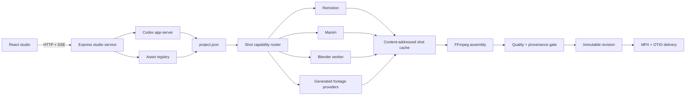

# Architecture

## Design principle

The timeline is the product. Renderers are replaceable workers. `project.json` must be sufficient to reopen, revise, inspect, reroute, and export a project without asking a model to reconstruct prior intent from chat.

## System map

## Control plane

`StudioService` owns projects, Codex threads, authentication state, durable jobs, version history, exports, and browser events. The browser never receives raw Codex command output or provider credentials. Server-sent events carry normalized project/job/message updates.

One long-lived `codex app-server` process is shared by the local Studio server. Each project receives its own Codex thread and working directory. Revision turns resume that thread so the agent can patch the existing project instead of regenerating from zero.

## Data plane

`VideoProjectIR` in `shared/video-ir.ts` is the canonical contract:

- format and color space;
- design and motion tokens;
- production brief and storyboard;
- ordered shots;
- typed tracks and clips;
- transforms, keyframes, styles, and renderer ownership;
- local assets with license/provenance metadata;
- measured narration and word timing;
- renderer-specific shot metadata.

`writeProjectBundle` validates and atomically replaces `project.json`. Versions copy the bundle and derived review artifacts into `versions/vNNN/`.

## Render path

1. The router selects the narrowest capable renderer from shot intent.
2. The cache key hashes stable shot content, format, design tokens, and referenced asset hashes.
3. Cache misses render only the affected shot.
4. Every non-Remotion result is normalized to the same dimensions, FPS, H.264 pixel format, AAC stream, duration, and fast-start contract.
5. FFmpeg concatenates normalized shots and creates a smaller proxy.
6. Narration is synthesized/muxed when requested.
7. Poster, contact sheet, metadata, QA, and provenance are generated.
8. Only a passing result is copied into immutable version history.

Generated footage has an additional durable record under `.generations/<shot-id>.json`. It stores provider, external job ID, progress, model, request, status, and the final output location. Provider URLs are never used as long-term project media.

## Renderer boundaries

| Renderer | Owns | Does not own |
| --- | --- | --- |
| Remotion | Type, UI, captions, footage, shapes, 2D motion, browser preview | Complex technical vector construction, 3D simulation |
| Manim | Equations, graphs, geometry, technical diagrams | General compositing and stock footage editing |
| Blender | 3D primitives, materials, lights, cameras, keyframes | Arbitrary project Python in the constrained worker path |
| Generated | Organic/cinematic footage that deterministic tools cannot author efficiently | Text layout, factual diagrams, final assembly |
| FFmpeg | Normalize, concatenate, mix, transcode, proxy, thumbnails | Creative scene planning |

## Quality gate

Static checks run against the IR before or after rendering: schema, overlap, safe area, text size, contrast, empty text, asset license, commercial-use metadata, attribution, hashes, and narration timing.

Media checks use FFprobe/FFmpeg for output existence, resolution, FPS, duration, audio presence, black frames, frozen regions, silence, poster, and contact sheet. Errors block version archival; warnings reduce the score and remain visible in `quality-report.json`.

## Security model

The local MVP trusts the person running the repository and binds only to loopback. It still applies important boundaries:

- keys remain in server environment variables;
- asset imports require HTTPS, block private-network targets, cap bytes, and hash content;
- Blender accepts data, not arbitrary Python;
- Manim scene paths cannot escape the project;
- export paths cannot escape the project;
- archived versions are immutable by convention;
- generated providers are called only when a timeline explicitly contains a generated shot.

Public hosting requires containerized workers, tenant authorization, durable external queues/storage, spend limits, verified webhooks, and stronger code execution isolation.
